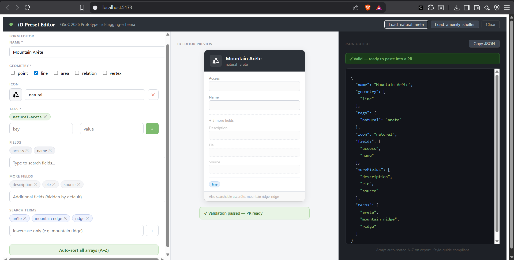

# iD Preset Editor — GSoC 2026 Prototype

A browser-based visual editor for creating and validating [id-tagging-schema](https://github.com/openstreetmap/id-tagging-schema) presets — the JSON definitions that power the [iD OpenStreetMap editor](https://github.com/openstreetmap/iD).

**Live demo:** _your-github-pages-link-here_



---

## Why this exists

Contributing presets to id-tagging-schema today means:
1. Cloning the repo
2. Hand-writing JSON
3. Running local validation
4. Opening a PR and iterating through review

This tool removes steps 1–3. You fill out a form, see a live preview of how the preset will look inside the iD editor sidebar, and export PR-ready JSON — without touching a raw file.

This is a **prototype** built as part of my GSoC 2026 application for the [Web-Based Collaborative Editing Core](https://wiki.openstreetmap.org/wiki/Google_Summer_of_Code/2026/Project_ideas) project.

---

## Features

| Feature | Status |
|---|---|
| Form editor — name, geometry, tags, icon, fields, moreFields, search terms | ✅ |
| Live iD sidebar preview (WYSIWYG) | ✅ |
| Maki icon picker with search (100+ icons from [@mapbox/maki](https://github.com/mapbox/maki)) | ✅ |
| Field autocomplete from real id-tagging-schema field names | ✅ |
| Real-time validation — Title Case, A–Z sorting, required fields | ✅ |
| Syntax-highlighted JSON output | ✅ |
| One-click auto-sort all arrays (A–Z) | ✅ |
| Copy-to-clipboard JSON export | ✅ |
| Example presets from merged PRs (#2024 natural=arete, #1993 amenity=shelter) | ✅ |

---

## Tech stack

- **React 18** with Vite — fast HMR, minimal setup
- **useState only** — no external state library in this prototype; the full GSoC implementation will use Zustand for the document model
- **Ajv-ready** — the `validate.js` module mirrors what the full Ajv + schema.json integration will do; upgrading it is a one-file change
- **Zero runtime dependencies** — icons load from the official `@mapbox/maki` CDN; everything else is vanilla React

---

## Run locally
```bash
git clone https://github.com/your-username/osm-preset-editor
cd osm-preset-editor
npm install
npm run dev
```

Open `http://localhost:5173`

---

## Project structure
```
src/
  App.jsx              # Root layout, shared state
  components/
    FormEditor.jsx     # Left panel — structured form with autocomplete
    IDPreview.jsx      # Centre panel — mock iD sidebar (WYSIWYG)
    JSONOutput.jsx     # Right panel — syntax-highlighted JSON + validation
  data/
    icons.js           # Maki icon name list
    fields.js          # Common field names for autocomplete
  utils/
    validate.js        # Real-time validation rules (Title Case, A–Z, required fields)
    generate.js        # JSON serializer — always outputs sorted, style-compliant JSON
```

---

## Validation rules enforced

These match the id-tagging-schema style guide and surfaced repeatedly in my PR reviews:

- `name` is required and must be Title Case (`Mountain Arête`, not `mountain arete`)
- `geometry` must have at least one valid OSM type
- `tags` must have at least one key=value pair
- `fields` and `moreFields` must be sorted A–Z (caught in PR #2066)
- `terms` must be lowercase (search aliases, not display names)

---

## Relation to the GSoC proposal

This prototype demonstrates the core loop described in the proposal:

> *"Contributors open existing schema files, edit presets through structured forms, pick icons from a visual gallery, and export schema-compliant JSON without touching the raw file directly."*

The full GSoC implementation extends this with:
- Ajv validation against the official `schema.json`
- Zustand state bridge for complex document trees
- `moreFields` inheritance and nested preset support
- Shareable draft links (Review Mode)
- GitHub PR description generator
- Taginfo integration for real-world tag usage stats

---

## Related contributions

This prototype is informed by direct experience with the subsystems it touches:

- **PR #2024** — `natural=arete` (used as example preset)
- **PR #1993** — `amenity=kitchen`
- **PR #1967** — access field on `amenity=shelter`
- **PR #1986** — 52-comment discussion on field label conventions
- **PR #2065** — nested sub-tags and icon pipeline (`temaki-horse_shelter`)

---

## Author

**Anushree Sharma** · [ashree2118@gmail.com](mailto:ashree2118@gmail.com)  
B.Tech Computer Science, Maharaja Surajmal Institute of Technology  
OSM: [ashree2118](https://www.openstreetmap.org/user/ashree2118) · GitHub: [ashree2118](https://github.com/ashree2118)